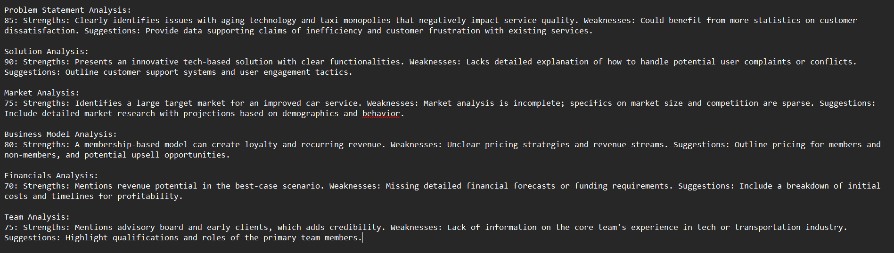

# ASSIGNMENT-1


# Founder-Investor Matching

This project implements and AI-driven model to match startup founders with potential investors based on their preferences. By leveraging Gemini API, the model analyzes investor preferences and startup details to generate a compatibility score, ranking investors based on their suitability.

## Dataset

The sample dataset includes:
- Founder Information: Industry, startup stage, funding required, traction, business model.
- Investor Preferences: Preferred industry,  investment range, and other criteria.

## Steps to Implement
### Data Preprocessing:

- Load the structured dataset.
- Normalize and format the input data.

### Gemini API Integration:

- Send founder and investor details to the API.
- Extract compatibility insights from the response.

### Match Score Calculation:

- Define a scoring algorithm that evaluates compatibility based on investor-founder alignment.
- Assign a score to each investor.

### Output Generation:

- Return a ranked list of investors based on match scores.
- Format results in a structured manner.

### Steps to run the project:
- Outlined in the ```assignment1.ipynb``` notebook

### Sample Output:


----------------------------------------------------------------------------------------------------------------------------------------------------------------------------------------------------------------


# ASSIGNMENT-2


# AI Pitch Analysis Model

This project implements an AI-driven model that takes a startup pitch deck and analyzes it to provide a quality score & personalised feedback outlining the stregths, weaknesses and possible improvements in each of the important sections.

## Dataset & Inputs

- A set of sample pitch decks (PDFs)

- AI model must extract and analyze key sections:

  - Problem

  - Solution

  - Market

  - Business Model

  - Financials

  - Team

## Steps to implement:
### Text Extraction & Preprocessing
- Use OCR or PDF parsing to extract text.
- Preprocess the text

### Feature Engineering
- Identify key sections from the pitch deck.

### Scoring Model
- Use LLM-based evaluation (GPT, Gemini API, or fine-tuned BERT model).
- Analyze the quality of each section based on predefined metrics.
- Generate a pitch score (0-100).

### Strength & Weakness Analysis
- Provide personalized feedback highlighting areas for improvement.
- Suggest content improvements or additional data needed.

### Output
- Display pitch score and AI-generated feedback.

### Sample Outputs

