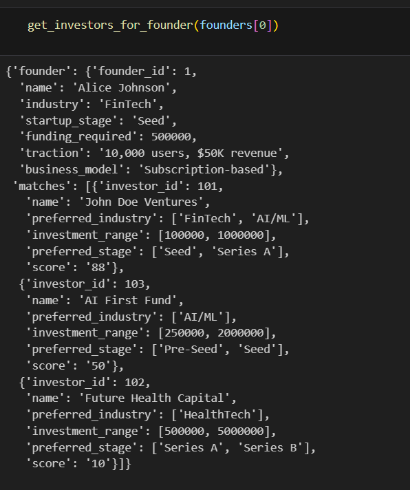

# Founder-Investor Matching

This project implements and AI-driven model to match startup founders with potential investors based on their preferences. By leveraging Gemini API, the model analyzes investor preferences and startup details to generate a compatibility score, ranking investors based on their suitability.

## Dataset

The sample dataset includes:
- Founder Information: Industry, startup stage, funding required, traction, business model.
- Investor Preferences: Preferred industry,  investment range, and other criteria.

## Steps to Implement
### Data Preprocessing:

- Load the structured dataset.
- Normalize and format the input data.

### Gemini API Integration:

- Send founder and investor details to the API.
- Extract compatibility insights from the response.

### Match Score Calculation:

- Define a scoring algorithm that evaluates compatibility based on investor-founder alignment.
- Assign a score to each investor.

### Output Generation:

- Return a ranked list of investors based on match scores.
- Format results in a structured manner.

### Steps to run the project:
- Outlined in the ```assignment1.ipynb``` notebook

### Sample Output:

