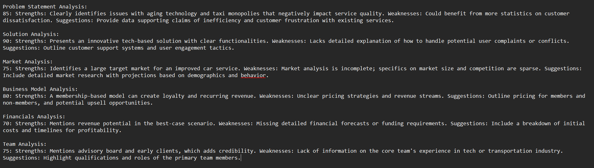

# AI Pitch Analysis Model

This project implements an AI-driven model that takes a startup pitch deck and analyzes it to provide a quality score & personalised feedback outlining the stregths, weaknesses and possible improvements in each of the important sections.

## Dataset & Inputs

- A set of sample pitch decks (PDFs)

- AI model must extract and analyze key sections:

  - Problem

  - Solution

  - Market

  - Business Model

  - Financials

  - Team

## Steps to implement:
### Text Extraction & Preprocessing
- Use OCR or PDF parsing to extract text.
- Preprocess the text

### Feature Engineering
- Identify key sections from the pitch deck.

### Scoring Model
- Use LLM-based evaluation (GPT, Gemini API, or fine-tuned BERT model).
- Analyze the quality of each section based on predefined metrics.
- Generate a pitch score (0-100).

### Strength & Weakness Analysis
- Provide personalized feedback highlighting areas for improvement.
- Suggest content improvements or additional data needed.

### Output
- Display pitch score and AI-generated feedback.

### Sample Outputs
